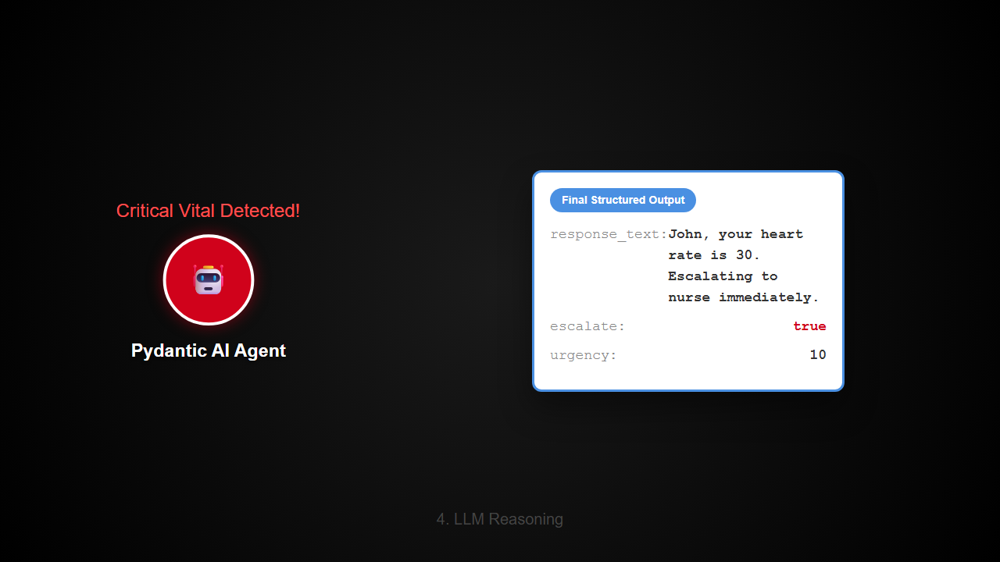
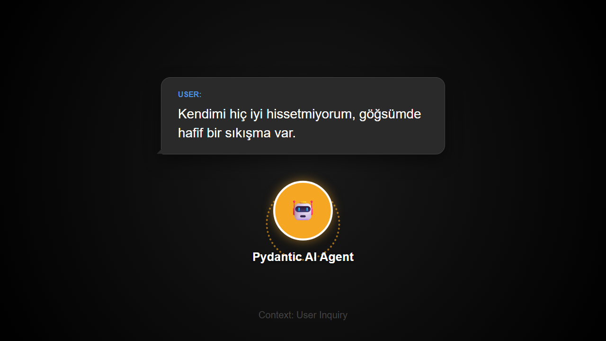
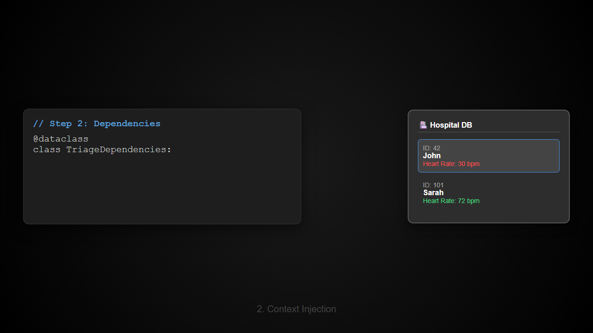

# Pydantic AI Triage Agent

Production-ready **AI Agent** using [Pydantic AI](https://github.com/pydantic/pydantic-ai) for hospital triage (patient prioritization).

Agent combines database vitals (heart rate, blood pressure) with LLM reasoning to produce structured, type-safe output: escalation flag + urgency score.

## Demo



<details>
<summary>Watch Demo Video 1</summary>
<video src="assets/paydantic_ai_triage.mp4" controls="controls" muted="muted" style="max-width:100%;"></video>
</details>

<details>
<summary>Watch Demo Video 2</summary>
<video src="assets/paydantic_ai_triage2.mp4" controls="controls" muted="muted" style="max-width:100%;"></video>
</details>

## Screenshots

**Chat Interface:**  


**Test Results:**  


---

## Architecture

```
user message ──► Agent (GPT-4o)
                    ├── System Prompt (dynamic patient name from DB)
                    ├── Tool: get_latest_vitals()
                    └── Output: TriageOutput { response_text, escalate, urgency }
```

## Files

| File | Purpose |
|------|---------|
| `database.py` | Mock patient database with vitals |
| `models.py` | Pydantic models (TriageOutput, TriageDependencies) |
| `agent.py` | Agent definition with tools + dynamic prompts |
| `main.py` | Entry point |
| `test_triage.py` | TDD tests |

## Quick Start

```bash
pip install -r requirements.txt
OPENAI_API_KEY=sk-... python -m pydantic_ai_triage.main
```

## Running Tests

```bash
pytest test_triage.py -v
```

## Test Results

```
7 passed in 2.32s
```

| Test | What it validates |
|------|-------------------|
| `test_mock_database_returns_patient_name` | DB returns correct name |
| `test_mock_database_returns_unknown_for_invalid_id` | Unknown patient fallback |
| `test_triage_output_has_required_fields` | Pydantic model construction |
| `test_triage_output_validation_rejects_invalid_urgency` | Range validation (1-10) |
| `test_triage_dependencies_stores_patient_id_and_db` | Dataclass construction |
| `test_triage_agent_initialization` | Agent created with correct config |
| `test_run_triage_returns_structured_output` | End-to-end mocked run |
